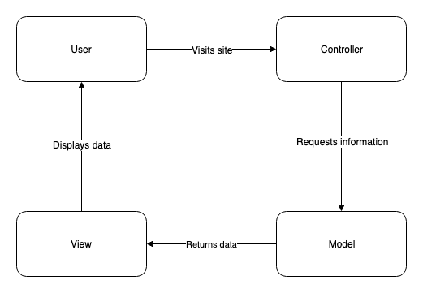

# Music Manager

A place for me to store links to music I find across the web, including YouTube, Spotify and Soundcloud. They are embedded them so they're easily playable. I can sort links by date and name.

The site will have all the following specifications:

- Show a list of bookmarks
- Add new bookmarks
- Delete bookmarks
- Update bookmarks
- Comment on bookmarks
- Tag bookmarks into categories
- Filter bookmarks by tag
- Users are restricted to manage only their own bookmarks

### User Stories

```sh
As a user,
So that I can see music I have found across the web,
I would like to see a list of my saved links
```

```sh
As a user,
So that I can save links to that I find,
I would like to be able to save links.
```

```sh
As a user,
So that I can remove mistakes,
I would like to be able to delete links.
```

```sh
As a user,
So that I can correct mistakes,
I would like to be able to update links.
```

```sh
As a user,
So that my friends can give me more information on a link,
I would like to be able to comment on links.
```

```sh
As a user,
So that I can categorise my links,
I would like to be able to tag genre and other important information to links.
```

```sh
As a user,
So that I can navigate my saved links easily,
I would like to be able to sort links by tag, name and date added.
```

```sh
As a user,
So that I have control of my music,
I want to be the only person with the ability to manage my saved links.
```

```sh
As a user,
So that I can find links I have saved,
I would like to be able to search my links.
```

```sh
As a user,
So that I can play the links I have saved easily,
I would like the links to be embedded within the listing.
```


